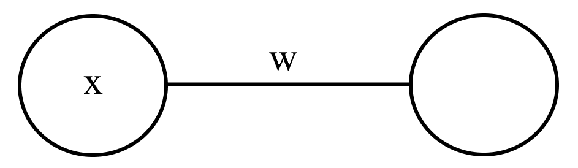

# Mathematics

**Mathematics** is an area of knowledge, which includes the study of such topics as numbers, formulas and related structures, shapes and spaces in which they are contained, and quantities and their changes. There is no general consensus about its exact scope or epistemological status. However, it is extremely labourious and time-consuming but necessary and is sometimes (albeit very rarely) interesting.

Neural Networks are somewhat interesting. Everyone kind of knows the math behind NNs (the gist of it). It was taught in **CS5131** to a very limited extent but not many know about the full math behind deep and convolutional neural networks. I mean people get that it has something to do with backpropogation or whatever, but how do you scale it up to multiple value and multiple derivatives. As you will come to learn, these derivations are incredibly computationally intensive and time-consuming, especially during implementation. But I have done it because I care about AppVenture and I want to help the casual onlooker understand the many trials and tribulations a simple layer goes through to deliver what we should consider peak perfection. It was a fun but painful exercise and I gained a deeper understanding of the mathematical constructs that embody our world. Anyways, let's start out with a referesher. Warning that Matrix Math lurks ahead, so tread with caution. This is deeper than **CS5131** could have ever hoped to cover, so you will learn some stuff with this excercise. This first part is about the math behind deep neural networks.

This article is written with some assumed knowledge of the reader but it is not that bad for most CS students especially since NNs are baby level for the most part. Nonetheless, assumed knowledge is written below.
- Deep Neural Network (How to implement + basic understanding of the math)
- Gradient Descent
- Linear Algebra

If you don't know this stuff, all you really need to do is read an introduction to linear algebra, understand how matrices and vectors are multiplied and watch 3b1b's series on machine learning.

Let's start by importing our bff for life, **Numpy**.

```python
>>> import numpy as np
```

Numpy is introduced in CS4132 (or PC6432 for some reason), but for a quick summary, it is a Linear Algebra library, which means it is VERY useful in this task.


## Gradient Descent Example (Linear System Solution)

Observe the following series of mathematical equations:

$$
\begin{aligned}
4a+2b&=22\\
3a+8b&=49
\end{aligned}
$$

Despite the fact that solving these is pretty easy (as we learnt in Year 1), let's try going with a different solution from what is usually portrayed. Let's try using **gradient descent**.

If you remember, Gradient Descent is a method used to solve any sort of equation by taking steps towards the real value by using calculus to predict the direction and size of the step. Essentially if you remember in calculus, the minimum of the graph will have a tangent of slope 0 and hence we can understand the direction of these "steps" to solve the problem. We just need a function where the derivative and function result approach 0 as you get closer to the true solution. This function is known as the objective function.

As you probably know, a linear equation is written as such:

$$
A \mathbf{x}-\mathbf{b}=0
$$

where $A$ is a known square matrix, $\mathbf{b}$ is a known vector and $\mathbf{x}$ is an unknown vector.

In this case, for the objective function we will use Linear Least Squares (LLS) function as it is an accurate thing to minimize in this case written below. 

$$F(\mathbf{x}) = {||A\mathbf{x}-\mathbf{b}||}_{2}^{2}$$

### Matrix Calculus

Now, what do the weird lines and two occurences of "2" above mean and how exactly do we calculate the derivative of a scalar in terms of a vector? Well we have to learn matrix calculus, a very peculiar domain of math that is very torturous. Ideally, you want to avoid this at all cost, but I will do a gentle walk through this stuff.

Firstly, let's revise derivatives wth this simple example:

$$
\begin{aligned}
y&=sin(x^2)+5\\
\frac{dy}{dx}&=\frac{d}{dx}\left(sin(x^2)+5\right)\\
&=2xcos(x^2)
\end{aligned}
$$

For functions with multiple variables, we can find the partial derivative with respect to each of the variables, as shown below:
$$
\begin{aligned}
f(x,y)&=3xy+x^2\\
\frac{\partial f(x,y)}{\partial x}&=3y+2x\\
\frac{\partial f(x,y)}{\partial y}&=3x
\end{aligned}
$$


A thing to understand is that vectors are just a collection of numbers, so an n-sized vector will have n partial derivatives if the function is $f:\mathbb{R}^{n} \rightarrow \mathbb{R}$ (the derivative is known as the gradient). But do we represent these n partial derivatives as a column vector or row vector?

$$\frac{\partial y}{\partial\mathbf{x}} = 
\begin{bmatrix}
\frac{\partial y}{\partial{\mathbf{x}}_{1}}\\
\frac{\partial y}{\partial{\mathbf{x}}_{2}}\\
\vdots\\
\frac{\partial y}{\partial{\mathbf{x}}_{n}}\\
\end{bmatrix}
$$

$$
\frac{\partial y}{\partial\mathbf{x}} = 
\begin{bmatrix}
\frac{\partial y}{\partial{\mathbf{x}}_{1}} & \frac{\partial y}{\partial{\mathbf{x}}_{2}} & \cdots & \frac{\partial y}{\partial{\mathbf{x}}_{n}}
\end{bmatrix}
$$

Well, both actually can work (even if you think of a vector as a column vector), the first version is called the denominator layout and the second one is called the numerator layout. They are both transpositions of each other. For gradient descent the denominator layout is more natural because for standard practice because we think of a vector as a column vector. I also prefer the denominator layout. However, the numerator layout follows the rules of single variable calculus more normally and will be much easier to follow. For example, matrices do not have commutative multiplication so the direction you chain terms matters. We naturally think of chaining terms to the back and this is true for numerator layout but in denominator layout terms are chained to the front. Product rule also is more funny when it comes to denom layout. So moving forward we will stick with the numerator layout and transpose the matrix or vector once the derivative is found. We will also stick to column vectors.

First lets look at the $A\mathbf{x}-\mathbf{b}$ term and we will see why the derivative is so and so with a simple $2 \times 2$ case. $A\mathbf{x}-\mathbf{b}$ is a $f:\mathbb{R}^{n} \rightarrow \mathbb{R}^{n}$ and hence the derivative will be a matrix (known as the Jacobian to many). Lets first, see the general equation and work it out for every value.

$$
\begin{aligned}
\mathbf{y} &= A\mathbf{x}-\mathbf{b}\\
\begin{bmatrix}
{\mathbf{y}}_{1} \\
{\mathbf{y}}_{2}
\end{bmatrix}
&=
\begin{bmatrix}
{a}_{11} & {a}_{12}\\
{a}_{21} & {a}_{22}\\
\end{bmatrix}
\begin{bmatrix}
{\mathbf{x}}_{1} \\
{\mathbf{x}}_{2}
\end{bmatrix}
-
\begin{bmatrix}
{\mathbf{b}}_{1} \\
{\mathbf{b}}_{2}
\end{bmatrix} \\
&=
\begin{bmatrix}
{a}_{11}{\mathbf{x}}_{1} + {a}_{12}{\mathbf{x}}_{2}-{\mathbf{b}}_{1} \\
{a}_{21}{\mathbf{x}}_{1} + {a}_{22}{\mathbf{x}}_{2}-{\mathbf{b}}_{1}
\end{bmatrix}
\end{aligned}
$$

Now we calculate the Jacobian (remember that it is transposed) by calculating the individual derivative for every value.

$$
\begin{aligned}
\frac{\partial \mathbf{y}}{\partial \mathbf{x}} &=
\begin{bmatrix}
\frac{\partial {\mathbf{y}}_{1}}{\partial{\mathbf{x}}_{1}} & \frac{\partial {\mathbf{y}}_{1}}{\partial{\mathbf{x}}_{2}}\\
\frac{\partial {\mathbf{y}}_{2}}{\partial{\mathbf{x}}_{1}} & \frac{\partial {\mathbf{y}}_{2}}{\partial{\mathbf{x}}_{2}}\\
\end{bmatrix} \\
\frac{\partial {\mathbf{y}}_{1}}{\partial{\mathbf{x}}_{1}} &= {a}_{11}\\
\frac{\partial {\mathbf{y}}_{1}}{\partial{\mathbf{x}}_{2}} &= {a}_{12}\\
\frac{\partial {\mathbf{y}}_{2}}{\partial{\mathbf{x}}_{1}} &= {a}_{21}\\
\frac{\partial {\mathbf{y}}_{2}}{\partial{\mathbf{x}}_{2}} &= {a}_{22}\\
\frac{\partial \mathbf{y}}{\partial \mathbf{x}} &= 
\begin{bmatrix}
{a}_{11} & {a}_{12}\\
{a}_{21} & {a}_{22}\\
\end{bmatrix}
= A
\end{aligned}
$$

We see that it is kind of the same with single variable, where if we have $f(x)=ax$, then $f'(x)=a$ where a is constant.

Now we look at the lines and "2"s. This is a common function known as the euclidean norm or 2-norm.

$$\|{\mathbf {x}}\|_{2}:={\sqrt {x_{1}^{2}+\cdots +x_{n}^{2}}}$$

We then square it giving rise to the second "2". Now we define and do the same thing we did with $Ax-b$, $\|{\mathbf {y}}\|_{2}^{2}$ is $f:\mathbb{R}^{n} \rightarrow \mathbb{R}$. Hence, the derivative is a row vector.

$$
\begin{aligned}
z&=\|{\mathbf {y}}\|_{2}^{2}\\
&={\mathbf {y}}_{1}^{2} + {\mathbf {y}}_{2}^{2}
\end{aligned}
$$

Now we calculate the Gradient (remember that it is transposed) by calculating the individual derivative for every value.

$$
\begin{aligned}
\frac{\partial F(\mathbf{x})}{\partial\mathbf{y}} &=
\begin{bmatrix}
\frac{\partial F(\mathbf{x})}{\partial{\mathbf{y}}_{1}} & \frac{\partial F(\mathbf{x})}{\partial{\mathbf{y}}_{2}}
\end{bmatrix} \\
\frac{\partial F(\mathbf{x})}{\partial{\mathbf{y}}_{1}} &= 2\mathbf{y}_{1} \\
\frac{\partial F(\mathbf{x})}{\partial{\mathbf{y}}_{2}} &= 2\mathbf{y}_{2} \\
\frac{\partial F(\mathbf{x})}{\partial\mathbf{y}} &=
\begin{bmatrix}
2\mathbf{y}_{1} & 2\mathbf{y}_{2}
\end{bmatrix}
= 2\mathbf{y}^{T}
\end{aligned}
$$

To illustrate the chain rule, I will calculate it individually and put it all together.

$$
\begin{aligned}
F(\mathbf{x}) &= {||A\mathbf{x}-\mathbf{b}||}_{2}^{2} \\
&= {({a}_{11}{\mathbf{x}}_{1} + {a}_{12}{\mathbf{x}}_{2}-{\mathbf{b}}_{1})}^{2} +
{({a}_{21}{\mathbf{x}}_{1} + {a}_{22}{\mathbf{x}}_{2}-{\mathbf{b}}_{1})}^{2} \\
\end{aligned}
$$

Now we calculate the Final Gradient by calculating the individual derivative for every value.

$$
\begin{aligned}
\frac{\partial F(\mathbf{x})}{\partial\mathbf{x}} &=
\begin{bmatrix}
\frac{\partial F(\mathbf{x})}{\partial{\mathbf{x}}_{1}} & \frac{\partial F(\mathbf{x})}{\partial{\mathbf{x}}_{2}}
\end{bmatrix}\\
\frac{\partial F(\mathbf{x})}{\partial{\mathbf{x}}_{1}} &= 2{a}_{11}({a}_{11}{\mathbf{x}}_{1} + {a}_{12}{\mathbf{x}}_{2}-{\mathbf{b}}_{1}) + 2{a}_{21}({a}_{21}{\mathbf{x}}_{1} + {a}_{22}{\mathbf{x}}_{2}-{\mathbf{b}}_{1})\\
\frac{\partial F(\mathbf{x})}{\partial{\mathbf{x}}_{2}} &= 2{a}_{12}({a}_{11}{\mathbf{x}}_{1} + {a}_{12}{\mathbf{x}}_{2}-{\mathbf{b}}_{1}) + 2{a}_{22}({a}_{21}{\mathbf{x}}_{1} + {a}_{22}{\mathbf{x}}_{2}-{\mathbf{b}}_{1})\\
\frac{\partial F(\mathbf{x})}{\partial\mathbf{x}} &=
\begin{bmatrix}
2{a}_{11}({a}_{11}{\mathbf{x}}_{1} + {a}_{12}{\mathbf{x}}_{2}-{\mathbf{b}}_{1}) + 2{a}_{21}({a}_{21}{\mathbf{x}}_{1} + {a}_{22}{\mathbf{x}}_{2}-{\mathbf{b}}_{1}) & 2{a}_{12}({a}_{11}{\mathbf{x}}_{1} + {a}_{12}{\mathbf{x}}_{2}-{\mathbf{b}}_{1}) + 2{a}_{22}({a}_{21}{\mathbf{x}}_{1} + {a}_{22}{\mathbf{x}}_{2}-{\mathbf{b}}_{1})
\end{bmatrix}\\
&= 2
\begin{bmatrix}
{a}_{11}{\mathbf{x}}_{1} + {a}_{12}{\mathbf{x}}_{2}-{\mathbf{b}}_{1} &
{a}_{21}{\mathbf{x}}_{1} + {a}_{22}{\mathbf{x}}_{2}-{\mathbf{b}}_{1}
\end{bmatrix}
\begin{bmatrix}
{a}_{11} & {a}_{12} \\
{a}_{21} & {a}_{22} \\
\end{bmatrix} = 2{(A\mathbf{x}-\mathbf{b})}^{T}A
\end{aligned}
$$

As we can see from that last step, its pretty complex an expression, but you can see how neat matrix notation is as compared to writing all that out and you see how matrix calculus works. With numerator layout, its very similar to single-variable but with a few extra steps.

I then transpose the derivative back into the denominator layout written below. The step function is also written below which we will use for the gradient descent.

$$
\begin{aligned}
F(\mathbf{x}) &= {||A\mathbf{x}-\mathbf{b}||}^{2} \\
\nabla F(\mathbf {x} ) &= 2 A^{T}(A\mathbf {x} -\mathbf{b}) \\
\mathbf{x}_{n+1} &= \mathbf{x}_{n}-\gamma \nabla F(\mathbf {x} _{n})
\end{aligned}
$$

where $\gamma$ is the learning rate, we need a small learning rate as it prevents the function from taking large steps and objective functions tend to overblow the "true" error of a function. 

We can now implement this in code form for a very simple linear system written below:

$$
\begin{aligned}
w+3x+2y-z=9\\
5w+2x+y-2z=4\\
x+2y+4z=24\\
w+x-y-3z=-12
\end{aligned}
$$

This can be written as such in matrix form:

$$
\begin{bmatrix}
1 & 3 & 2 & -1\\
5 & 2 & 1 & -2\\
0 & 1 & 2 & 4\\
1 & 1 & -1 & -3
\end{bmatrix}
\begin{bmatrix}
w\\
x\\
y\\
z
\end{bmatrix}
=
\begin{bmatrix}
9\\
4\\
24\\
-12
\end{bmatrix}
$$

### Code Implementation

#### Variables

$$
A=
\begin{bmatrix}
1 & 3 & 2 & -1\\
5 & 2 & 1 & -2\\
0 & 1 & 2 & 4\\
1 & 1 & -1 & -3
\end{bmatrix}
$$

```python
>>> A = np.array([[1,3,2,-1],[5,2,1,-2],[0,1,2,4],[1,1,-1,-3]], dtype=np.float64)
>>> A
array([[ 1.,  3.,  2., -1.],
       [ 5.,  2.,  1., -2.],
       [ 0.,  1.,  2.,  4.],
       [ 1.,  1., -1., -3.]])
```


$$
\mathbf{b}=
\begin{bmatrix}
9\\
4\\
24\\
-12
\end{bmatrix}
$$

```python
>>> b = np.array([[9],[4],[24],[-12]], dtype=np.float64) 
>>> b
array([[  9.],
       [  4.],
       [ 24.],
       [-12.]])
```

$$
\mathbf{x}=
\begin{bmatrix}
w\\
x\\
y\\
z
\end{bmatrix}
$$

```python
>>> x = np.random.rand(4,1)
>>> x
array([[0.09257854],
       [0.16847643],
       [0.39120624],
       [0.78484474]])
```

#### The Objective Function and its Derivative

$$
F(\mathbf{x}) = {||A\mathbf{x}-\mathbf{b}||}^{2}
$$

```python
>>> def objective_function(x):
        return np.linalg.norm(np.matmul(A,x) - b) ** 2
```

$$
\nabla F(\mathbf {x} )=2A^{T}(A\mathbf {x} -\mathbf {b})
$$

```python
>>> def objective_function_derivative(x):
        return 2 * np.matmul(A.T, np.matmul(A,x) - b)
```

In this case, I implemented an arbritary learning rate and arbritary step count. In traditional non-machine learning gradient descent, the learning rate changes per step and is determined via a heuristic such as the Barzilai–Borwein method, however this is not necessary as gradient descent is very robust. I used an arbritary step count for simplicity but you should ideally use some sort of boolean condition to break the loop such as $F(\mathbf{x})<0.01$.

$$
\mathbf {x}_{n+1}=\mathbf {x}_{n}-\gamma \nabla F(\mathbf {x} _{n})
$$

```python
>>> learning_rate = 0.01
>>> for i in range(5000):
        x -= learning_rate * objective_function_derivative(x)
>>> x
array([[1.],
       [2.],
       [3.],
       [4.]])
```

And to check, we now use a simple matrix multiplication:

```python
>>> np.matmul(A,x)
array([[  9.],
       [  4.],
       [ 24.],
       [-12.]])
```

Voila, we have solved the equation with gradient descent, and the solution is super close. This shows the power of gradient descent.

## Deep Neural Network Layer

To understand the math behind a deep neural network layer, we will first look at the single perceptron case.



$$
z=xw+b\\
a=\sigma (z)
$$

where $w$ is the weight, $b$ is the bias, $x$ is the input, $\sigma$ is the activation function and $a$ is the output.

We assume that this is a single layer network and that the loss function is just applied after, and we will just use the MSE loss.

$$c = {(a-y)}^2$$

where $y$ is the true y, $c$ is the cost.


In this case, it is quite easy to represent. Let us expand it to a layer with 4 input neurons and 4 output neurons.


$$
\begin{aligned}
{w}_{11}{x}_{1} + {w}_{21}{x}_{2} + {w}_{31}{x}_{3} + {w}_{41}{x}_{4} + {b}_{1} = &{z}_{1}\\
{w}_{12}{x}_{1} + {w}_{22}{x}_{2} + {w}_{32}{x}_{3} + {w}_{42}{x}_{4} + {b}_{2} = &{z}_{2}\\
{w}_{13}{x}_{1} + {w}_{23}{x}_{2} + {w}_{33}{x}_{3} + {w}_{43}{x}_{4} + {b}_{3} = &{z}_{3}\\
{w}_{14}{x}_{1} + {w}_{24}{x}_{2} + {w}_{34}{x}_{3} + {w}_{44}{x}_{4} + {b}_{4} = &{z}_{4}\\
{a}_{1}=\sigma(&{z}_{1})\\
{a}_{2}=\sigma(&{z}_{2})\\
{a}_{3}=\sigma(&{z}_{3})\\
{a}_{4}=\sigma(&{z}_{4})\\
c = \frac{1}{4} \left((a_1-y_1)^2 + (a_2 - y_2)^2 + (a_3 - y_3)^2 + (a_4 - y_4)^2\right)
\end{aligned}
$$

As you can see, this is just a linear system much like the one showed in the example and it becomes very simple.

$$
\begin{aligned}
\mathbf{z} &= W\mathbf{x} + \mathbf{b}\\
\mathbf{a} &= \sigma(\mathbf{z}) \\
c &= \frac{1}{n} ||\mathbf{a} - \mathbf{y}||^2_2
\end{aligned}
$$

From our work earlier we know that:

$$
\begin{aligned}
\frac{\partial \mathbf{z}}{\partial \mathbf{b}}&=I \\
\frac{\partial \mathbf{z}}{\partial \mathbf{x}}&= W \\
\frac{\partial c}{\partial \mathbf{a}} &= \frac{2}{n} \left(\mathbf{a} - \mathbf{y} \right)^\text{T}
\end{aligned}
$$


However we have once again hit a speedbump. How do we find the derivative of a vector $\mathbf{z}$ with respect to a matrix $W$? The function is of the form $f:\mathbb{R}^{m \times n} \rightarrow \mathbb{R}^{m}$. Hence, the derivative will be a third order tensor also known as a 3D matrix. (colloquially) But for now we will use a trick to dodge the usage of third order tensors because of the nature of the function $W\mathbf{x}$. For this example, I use $m=3$ and $n=2$ but its generalizable for any sizes.

$$
\begin{aligned}
\mathbf{z} = W\mathbf{x} + \mathbf{b}\\
\begin{bmatrix}
{\mathbf{z}}_{1} \\
{\mathbf{z}}_{2} \\
{\mathbf{z}}_{3}
\end{bmatrix} &= \begin{bmatrix}
{w}_{11} & {w}_{12}\\
{w}_{21} & {w}_{22}\\
{w}_{31} & {w}_{32}\\
\end{bmatrix}
\begin{bmatrix}
{\mathbf{x}}_{1} \\
{\mathbf{x}}_{2}
\end{bmatrix}
+
\begin{bmatrix}
{\mathbf{b}}_{1} \\
{\mathbf{b}}_{2} \\
{\mathbf{b}}_{3}
\end{bmatrix} \\
&=
\begin{bmatrix}
{w}_{11}{\mathbf{x}}_{1} + {w}_{12}{\mathbf{x}}_{2} - {\mathbf{b}}_{1}\\
{w}_{21}{\mathbf{x}}_{1} + {w}_{22}{\mathbf{x}}_{2} - {\mathbf{b}}_{1}\\
{w}_{31}{\mathbf{x}}_{1} + {w}_{32}{\mathbf{x}}_{2} - {\mathbf{b}}_{1}\\
\end{bmatrix}
\end{aligned}
$$

We now calculate the individual derivatives of $\mathbf{z}$ wrt to $W$.


$$
\begin{aligned}
\frac{\partial \mathbf{z}_{1}}{\partial w_{11}}=\mathbf{x}_{1}\quad
\frac{\partial \mathbf{z}_{2}}{\partial w_{11}}=0\quad
\frac{\partial \mathbf{z}_{3}}{\partial w_{11}}=0\\
\frac{\partial \mathbf{z}_{1}}{\partial w_{12}}=\mathbf{x}_{2}\quad
\frac{\partial \mathbf{z}_{2}}{\partial w_{12}}=0\quad
\frac{\partial \mathbf{z}_{3}}{\partial w_{12}}=0\\
\frac{\partial \mathbf{z}_{1}}{\partial w_{21}}=0\quad
\frac{\partial \mathbf{z}_{2}}{\partial w_{21}}=\mathbf{x}_{1}\quad
\frac{\partial \mathbf{z}_{3}}{\partial w_{21}}=0\\
\frac{\partial \mathbf{z}_{1}}{\partial w_{22}}=0\quad
\frac{\partial \mathbf{z}_{2}}{\partial w_{22}}=\mathbf{x}_{2}\quad
\frac{\partial \mathbf{z}_{3}}{\partial w_{22}}=0\\
\frac{\partial \mathbf{z}_{1}}{\partial w_{31}}=0\quad
\frac{\partial \mathbf{z}_{2}}{\partial w_{31}}=0\quad
\frac{\partial \mathbf{z}_{3}}{\partial w_{31}}=\mathbf{x}_{1}\\
\frac{\partial \mathbf{z}_{1}}{\partial w_{32}}=0\quad
\frac{\partial \mathbf{z}_{2}}{\partial w_{32}}=0\quad
\frac{\partial \mathbf{z}_{3}}{\partial w_{32}}=\mathbf{x}_{2}\\
\end{aligned}
$$

We see that this is a pretty complex looking tensor but we see that a majority of the values are 0 allowing us to pull of an epic hack by considering the fact that at the end we are essentially trying to get a singular scalar value (the loss) and find the partial derivative of that wrt to $W$. There are some steps involved in getting from $\mathbf{z}$ to $c$ but for simplicity instead of showing everything, we will condense all of this into a function $f:\mathbb{R}^{n} \rightarrow \mathbb{R}$ which is defined as $c=f(\mathbf{z})$. In this case, we know the tensor values and we know the gradient and what the derivative should be. Hence, we now just evaluate it and see if we can see any property:

$$
\begin{aligned}
\frac{\partial c}{\partial\mathbf{z}} &= 
\begin{bmatrix}
\frac{\partial c}{\partial{\mathbf{z}}_{1}} & \frac{\partial c}{\partial{\mathbf{z}}_{2}} & \frac{\partial c}{\partial{\mathbf{z}}_{2}}
\end{bmatrix} \\
\frac{\partial c}{\partial W} = 
\begin{bmatrix}
\frac{\partial c}{\partial{w}_{11}} & \frac{\partial c}{\partial{w}_{21}} & \frac{\partial c}{\partial{w}_{31}}\\
\frac{\partial c}{\partial{w}_{12}} & \frac{\partial c}{\partial{w}_{22}} & \frac{\partial c}{\partial{w}_{32}}
\end{bmatrix}
=
\frac{\partial c}{\partial \mathbf{z}}\frac{\partial \mathbf{z}}{\partial \mathbf{W}}
&=
\begin{bmatrix}
\frac{\partial c}{\partial{\mathbf{z}}_{1}}\frac{\partial {\mathbf{z}}_{1}}{\partial{w}_{11}} & \frac{\partial c}{\partial{\mathbf{z}}_{2}}\frac{\partial {\mathbf{z}}_{2}}{\partial{w}_{21}} & \frac{\partial c}{\partial{\mathbf{z}}_{3}}\frac{\partial {\mathbf{z}}_{3}}{\partial{w}_{31}}\\
\frac{\partial c}{\partial{\mathbf{z}}_{1}}\frac{\partial {\mathbf{z}}_{1}}{\partial{w}_{12}} & \frac{\partial c}{\partial{\mathbf{z}}_{2}}\frac{\partial {\mathbf{z}}_{2}}{\partial{w}_{22}} & \frac{\partial c}{\partial{\mathbf{z}}_{3}}\frac{\partial {\mathbf{z}}_{3}}{\partial{w}_{32}}
\end{bmatrix}
=
\begin{bmatrix}
\frac{\partial c}{\partial{\mathbf{z}}_{1}}\mathbf{x}_{1} & \frac{\partial c}{\partial{\mathbf{z}}_{2}}\mathbf{x}_{1} & \frac{\partial c}{\partial{\mathbf{z}}_{3}}\mathbf{x}_{1}\\
\frac{\partial c}{\partial{\mathbf{z}}_{1}}\mathbf{x}_{2} & \frac{\partial c}{\partial{\mathbf{z}}_{2}}\mathbf{x}_{2} & \frac{\partial c}{\partial{\mathbf{z}}_{3}}\mathbf{x}_{2}
\end{bmatrix}
=
\mathbf{x}\frac{\partial c}{\partial\mathbf{z}}
\end{aligned}
$$


Wonderful, we have just found out this amazing method, where we just add $\mathbf{x}$ to the front. Normally this method is not possible but it is just possible in this special case as we dont have to consider terms such as $\frac{\partial c}{\partial{\mathbf{z}}_{2}}\frac{\partial {\mathbf{z}}_{2}}{\partial{w}_{11}}$ because they are just 0. It helps us dodge all the possibilites of tensor calculus (at least for now) and allows the NumPy multiplication to be much easier. $f$ can also generalize for any vector to scalar function, not just the specific steps we make.

The next speedbump is much more easier to grasp than the last one, and that is element-wise operations. In this case, we have the activation function $\sigma:\mathbb{R}^{n} \rightarrow \mathbb{R}^{n}$ or $\sigma:\mathbb{R} \rightarrow \mathbb{R}$, which looks like a sigmoid function, but this is just a placeholder function. It can be any $\mathbb{R}$ to $\mathbb{R}$ activation function, such as $\text{RELU}(x) = \text{max}(x, 0)$, or whatever else has been found in research, such as SMELU and GELU. Once again, we work it out for every single value, as shown below:

$$
\begin{aligned}
\mathbf{a} &= \sigma(\mathbf{z})\\
\begin{bmatrix}
{\mathbf{a}}_{1} \\
{\mathbf{a}}_{2} \\
{\mathbf{a}}_{3}
\end{bmatrix}
&=
\sigma\left(
\begin{bmatrix}
{\mathbf{z}}_{1} \\
{\mathbf{z}}_{2} \\
{\mathbf{z}}_{3}
\end{bmatrix}\right)
=
\begin{bmatrix}
\sigma({\mathbf{z}}_{1}) \\
\sigma({\mathbf{z}}_{2}) \\
\sigma({\mathbf{z}}_{3})
\end{bmatrix}
\end{aligned}
$$

Now for the 48th billion time, we calculate the Jacobian by calculating every individual derivative to get the general property of the operation.

$$
\begin{aligned}
\frac{\partial \mathbf{a}}{\partial \mathbf{z}} &=
\begin{bmatrix}
\frac{\partial {\mathbf{a}}_{1}}{\partial{\mathbf{z}}_{1}} & \frac{\partial {\mathbf{a}}_{1}}{\partial{\mathbf{z}}_{2}}& \frac{\partial {\mathbf{a}}_{1}}{\partial{\mathbf{z}}_{3}}\\
\frac{\partial {\mathbf{a}}_{2}}{\partial{\mathbf{z}}_{1}} & \frac{\partial {\mathbf{a}}_{2}}{\partial{\mathbf{z}}_{2}} & \frac{\partial {\mathbf{a}}_{2}}{\partial{\mathbf{z}}_{3}}\\
\frac{\partial {\mathbf{a}}_{3}}{\partial{\mathbf{z}}_{1}} & \frac{\partial {\mathbf{a}}_{3}}{\partial{\mathbf{z}}_{2}} & \frac{\partial {\mathbf{a}}_{3}}{\partial{\mathbf{z}}_{3}}
\end{bmatrix}\\
\frac{\partial {\mathbf{a}}_{1}}{\partial{\mathbf{z}}_{1}}=\sigma^{'}(\mathbf{z}_{1})\quad
\frac{\partial {\mathbf{a}}_{1}}{\partial{\mathbf{z}}_{2}}&=0\quad
\frac{\partial {\mathbf{a}}_{1}}{\partial{\mathbf{z}}_{3}}=0\\
\frac{\partial {\mathbf{a}}_{2}}{\partial{\mathbf{z}}_{1}}=0\quad
\frac{\partial {\mathbf{a}}_{2}}{\partial{\mathbf{z}}_{2}}&=\sigma^{'}(\mathbf{z}_{2})\quad
\frac{\partial {\mathbf{a}}_{2}}{\partial{\mathbf{z}}_{3}}=0\\
\frac{\partial {\mathbf{a}}_{3}}{\partial{\mathbf{z}}_{1}}=0\quad
\frac{\partial {\mathbf{a}}_{3}}{\partial{\mathbf{z}}_{2}}&=0\quad
\frac{\partial {\mathbf{a}}_{3}}{\partial{\mathbf{z}}_{3}}=\sigma^{'}(\mathbf{z}_{3})\\
\frac{\partial \mathbf{a}}{\partial \mathbf{z}} &=
\begin{bmatrix}
\sigma^{'}(\mathbf{z}_{1}) & 0 & 0\\
0 & \sigma^{'}(\mathbf{z}_{2}) & 0\\
0 & 0 & \sigma^{'}(\mathbf{z}_{3})\\
\end{bmatrix}
=diag(\sigma^{'}(\mathbf{z}))
\end{aligned}
$$


As you see, we can reduce this derivative to this specific value. I have used the $diag$ operator which converts a vector to a diagonal matrix. Finally, after all this derivation (mathematically and figuratively) we can use chain rule to join everything together:

$$
\begin{aligned}
\frac{\partial c}{\partial \mathbf{b}}=\frac{\partial c}{\partial \mathbf{a}}\frac{\partial \mathbf{a}}{\partial \mathbf{z}}\frac{\partial \mathbf{z}}{\partial \mathbf{b}}
&=
\frac{2}{n}{(\mathbf{a}-\mathbf{y})}^{T}diag(\sigma^{'}(\mathbf{z}))\\
\frac{\partial c}{\partial \mathbf{x}}=\frac{\partial c}{\partial \mathbf{a}}\frac{\partial \mathbf{a}}{\partial \mathbf{z}}\frac{\partial \mathbf{z}}{\partial \mathbf{x}}
&=
\frac{2}{n}{(\mathbf{a}-\mathbf{y})}^{T}diag(\sigma^{'}(\mathbf{z}))W\\
\frac{\partial c}{\partial W}=\frac{\partial c}{\partial \mathbf{a}}\frac{\partial \mathbf{a}}{\partial \mathbf{z}}\frac{\partial \mathbf{z}}{\partial W}
&=
\frac{2}{n}\mathbf{x}{(\mathbf{a}-\mathbf{y})}^{T}diag(\sigma^{'}(\mathbf{z}))
\end{aligned}
$$

Now that we got these simple definitions for the single-layer case, we can expand it to the multi-layer case.

$$
\begin{aligned}
\mathbf{a}_{0}&=\mathbf{x}\\
\mathbf{z}_{i}&={W}_{i-1}{\mathbf{a}}_{i-1} + \mathbf{b}_{i-1}\\
\mathbf{a}_{i}&=\sigma(\mathbf{z}_{i})\\
i &= 1,2,3,...,L\\
c&=\frac{1}{n}\|{\mathbf{a}-\mathbf {y}}\|_{2}^{2}
\end{aligned}
$$

We can do the calculus for the $i$-th layer now, specifically for bias and weight using the chain rule.

$$
\begin{aligned}
\frac{\partial c}{\partial \mathbf{b}_{i-1}}=\frac{\partial c}{\partial \mathbf{a}_{L}}\frac{\partial \mathbf{a}_L}{\partial \mathbf{z}_{L}}\frac{\partial \mathbf{z}_{L}}{\partial \mathbf{a}_{L-1}}\cdots\frac{\partial \mathbf{a}_{i}}{\partial \mathbf{z}_{i}}\frac{\partial \mathbf{z}_{i}}{\partial \mathbf{b}_{i-1}}&=
\frac{2}{n}{(\mathbf{a}_L-\mathbf{y})}^{T}diag(\sigma^{'}(\mathbf{z}_L))W_{L-1}\cdots diag(\sigma^{'}(\mathbf{z}_i))\\
\frac{\partial c}{\partial W_{i-1}}=\frac{\partial c}{\partial \mathbf{a}_{L}}\frac{\partial \mathbf{a}_L}{\partial \mathbf{z}_{L}}\frac{\partial \mathbf{z}_{L}}{\partial \mathbf{a}_{L-1}}\cdots\frac{\partial \mathbf{a}_{i}}{\partial \mathbf{z}_{i}}\frac{\partial \mathbf{z}_{i}}{\partial W_{i-1}}&=
\frac{2}{n}\mathbf{a}_{i-1}{(\mathbf{a}_L-\mathbf{y})}^{T}diag(\sigma^{'}(\mathbf{z}_L))W_{L-1}\cdots diag(\sigma^{'}(\mathbf{z}_i))\\
i &= 1,2,3,...,L
\end{aligned}
$$

Now it is time to actually implement this network (finally).

## Neural Network Implementation (XNOR Gate)

I couldn't find a good, but rather small dataset because most people really do like large datasets and are infuriated when they are not provided that like ~~entitled brats~~ normal people. So, instead, I decided that we will train our neural network to mimic the XNOR gate.

Oh no! Training? Testing? What is that? In all fairness, I am simply trying to show you that the mathematical functions that dictate neural networks as we have found above, fits perfectly with this task of a neural network, and that these neural networks that everyone hears about can really just mimic any function.


For those who do not know, the XNOR gates inputs and outputs are written above. It is pretty suitable for this example, because the inputs and outputs are all 0 and 1, hence it is fast to train and there is no bias in the data.

From here, let's try coding out the (x,y) pairs in NumPy:

```python
data = [[np.array([[0],[0]], dtype=np.float64),np.array([[1]], dtype=np.float64)],
        [np.array([[0],[1]], dtype=np.float64),np.array([[0]], dtype=np.float64)],
        [np.array([[1],[0]], dtype=np.float64),np.array([[0]], dtype=np.float64)],
        [np.array([[1],[1]], dtype=np.float64),np.array([[1]], dtype=np.float64)]]
```
We then define a network structure. It doesn't have to be too complex because it is a pretty simple function. I decided on a $2 \rightarrow 3 \rightarrow 1$ multi-layer perceptron (MLP) structure, with the sigmoid activation function.


Next, let's try coding out our mathematical work based off the following class:

```python
class NNdata:
    def __init__(self):
        self.a_0 = None
        self.W_0 = np.random.rand(3,2)
        self.b_0 = np.random.rand(3,1)
        self.z_1 = None
        self.a_1 = None
        self.W_1 = np.random.rand(1,3)
        self.b_1 = np.random.rand(1,1)
        self.z_2 = None
        self.a_2 = None
        self.db_1 = None
        self.dw_1 = None
        self.db_0 = None
        self.dw_0 = None
        
    def sigmoid(self, x):
        return 1 / (1 + np.exp(-x))
    
    def sigmoid_derivative(self, x):
        return self.sigmoid(x) * (1 - self.sigmoid(x))
    
    def feed_forward(self, x):
        self.a_0 = x
        
        self.z_1 = np.matmul(self.W_0, self.a_0)+self.b_0
        self.a_1 = self.sigmoid(self.z_1)
        
        self.z_2 = np.matmul(self.W_1, self.a_1)+self.b_1
        self.a_2 = self.sigmoid(self.z_2)
        return self.a_2
        
    def loss(self, y):
        return np.linalg.norm(self.a_2-y)**2
    
    def back_prop(self, y):
        dcdz_2 = 2 * np.matmul((self.a_2-y).T,np.diag(self.sigmoid_derivative(self.z_2).reshape(1)))
        dcdb_1 = dcdz_2
        dcdw_1 = np.matmul(self.a_1, dcdz_2)
        
        dcda_1 = np.matmul(dcdz_2, self.W_1)
        dcdz_1 = np.matmul(dcda_1, np.diag(self.sigmoid_derivative(self.z_1).reshape(3)))
        dcdb_0 = dcdz_1
        dcdw_0 = np.matmul(self.a_0, dcdz_1)
        
        self.db_1 = dcdb_1.T
        self.dw_1 = dcdw_1.T
        self.db_0 = dcdb_0.T
        self.dw_0 = dcdw_0.T
```

Next I program gradient descent. There are 3 kinds of gradient descent when there are multiple datapoints, Stochastic, Batch and Mini-Batch. In Stochastic Gradient Descent (SGD), the weights are updated after a single sample is run. This will obviously cause your step towards the ideal value be very chaotic. In Batch Gradient Descent, the weights are updated after every sample is run, and the net step is the sum/average of all the $\nabla F(x)$, which is less chaotic, but steps are less frequent.

Of course, in real life, we can never know which algorithm is better without making an assumption about the data. (No Free Lunch Theorem) A good compromise is Mini-Batch Gradient Descent, which is like Batch Gradient Descent but use smaller chunks of all the datapoints every step. In this case, I use Batch Gradient Descent.


```python
nndata = NNdata()
learning_rate = 0.1
for i in range(10000):
    db_1_batch = []
    dw_1_batch = []
    db_0_batch = []
    dw_0_batch = []
    c = []
    for j in range(4):
        nndata.feed_forward(data[j][0])
        c.append(nndata.loss(data[j][1]))
        nndata.back_prop(data[j][1])
        db_1_batch.append(nndata.db_1)
        dw_1_batch.append(nndata.dw_1)
        db_0_batch.append(nndata.db_0)
        dw_0_batch.append(nndata.dw_0)
    if((i+1) % 1000 == 0):
        print("loss (%d/10000): %.3f" % (i+1, sum(c)/4))
    nndata.b_1 -= learning_rate * sum(db_1_batch)
    nndata.W_1 -= learning_rate * sum(dw_1_batch)
    nndata.b_0 -= learning_rate * sum(db_0_batch)
    nndata.W_0 -= learning_rate * sum(dw_0_batch)
```

Output resource:
```
loss (1000/10000): 0.245
loss (2000/10000): 0.186
loss (3000/10000): 0.029
loss (4000/10000): 0.007
loss (5000/10000): 0.003
loss (6000/10000): 0.002
loss (7000/10000): 0.002
loss (8000/10000): 0.001
loss (9000/10000): 0.001
loss (10000/10000): 0.001
```


Voila! We have officially programmed Neural Networks from scratch. Pat yourself on the back for reading through this. And of course, if you bothered to code this out, try porting it over to different languages like Java, JS or even C (yikes why would [anyone](https://github.com/terminalai/neuralC) subjects themselves to that?).

In the next part, it is time for the actual hard part. Good luck!


## References

A lot of people think I just collated a bunch of sources and rephrased, and honestly I walked into writing this thinking I would be doing just that. The problem is that many sources who have attempted to do this, only cover the single to multi-perceptron layer case and not the multi to multi-perceptron case. Which is pretty sad. The true math is hidden behind mountains of research papers that loosely connect to give the results of this blogpot which I am too incomponent to connect by myself. So, I just did the math myself. (The math may not be presented in this way but it works so it should be correct) Yes, it was a bit crazy, and it destroyed me to my core. This was a great character building moment for me. So these are the actual sources:

- https://numpy.org/
- https://en.wikipedia.org/wiki/Gradient_descent
- https://en.wikipedia.org/wiki/Matrix_calculus
- https://en.wikipedia.org/wiki/Tensor_calculus
- https://en.wikipedia.org/wiki/Ricci_calculus
- https://en.wikipedia.org/wiki/XNOR_gate
- CS5131 Notes (Special thanks to Mr Chua and Mr Ng)


<hr>

(Excruciatingly edited by Prannaya)
