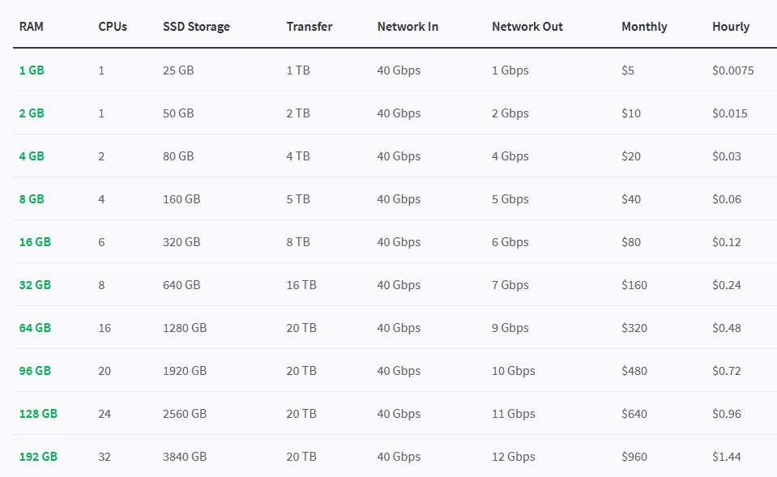
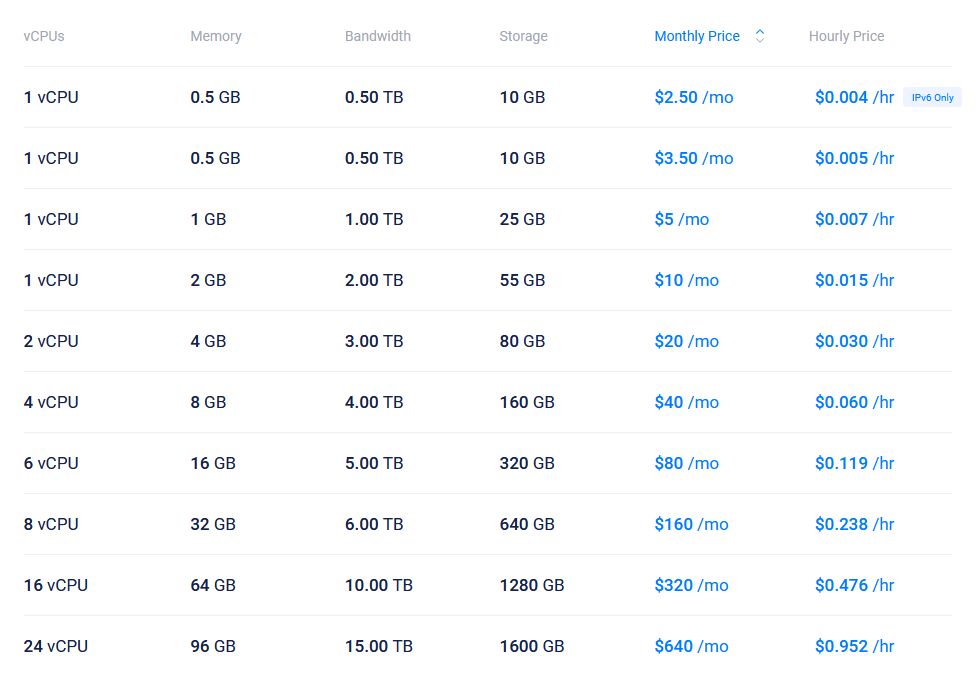

If you've had to look for an online host for:

- A static/dynamic website
- A backend API
- Miscellaneous self-hosted services like [Nextcloud](https://nextcloud.com/), [Wallabag](https://wallabag.org/en), [AirSonic](https://airsonic.github.io/) etc.
- Compute (Simulations, AI)
- Running a botnet

or other usecases, then it can be hard to choose which service to use, especially for the thinking self-hoster wishing optimize their productivity. In fact, here is the list of cloud services I'll be covering in this post alone.

**Static webhosts**
- Vercel
- Netlify
- Surge.sh
- Github pages (+ Github actions)

**Big Cloud**
- Amazon Web Services (AWS)
- Google Cloud Products (GCP)
- Oracle Cloud 

**Independent  Virtual Private Server (VPS) Providers** 
- DigitalOcean
- Linode
- Vultr

Thus, in this guide, I'll share some of my experiences with these products and my humble evaluation of performance, cost, and the strings attached. But first, let's find you your very own server for free.

# VPS Free Tiers

## Oracle VM instance

Oracle, a company which has racked up many sins, has made amends and bestows users 200GB boot volumes, 24GB RAM, 4 Oracle CPU server instances on its cloud platform. Well technically, due to supposed resource limitations in their Singaporean datacentres, it will play coy and may or may not allow you to max out some of the limits. Oh and you don't need to connect a credit card unlike every other cloud provider.

To setup your own server, login to your oracle cloud dashboard and click on **Create a VM instance** under Launch Resources. Choose the **Ampere series** under in the **Image and Shape** menu, make sure to save the private key for SSH and check **Specify a custom boot volume size** and set an amount as close to 200GB as it will allow. Note that in order to host stuff over the internet, [you have to open your ports by configuring ingress routes on the Oracle cloud interface and also configure the firewall on the server itself.](https://stackoverflow.com/a/64053781/13367211)

## DigitalOcean

Although not as good of a deal as Oracle's, through the GitHub student pack you can redeem \$100 of DigitalOcean credits which last indefinitely, unlike the "\$100 for 3 months" offers available by scouring for referral links online. With the [updated pricing](https://www.digitalocean.com/try/new-pricing) (billing is per hour), this will get you a 1GB server for 16 months or a 2GB server for 8 months.  Alternatively, if you just want to blow it on compute resources (max. 8GB unless you request for 16GB or the specialized droplets), then you might as well just use referral links.


# Other VPS services

## Linode & Vultr

Up until the recent pricing updates to DigitalOcean, DigitalOcean, Linode and Vultr have had near-identical pricing where there wasn't much different between the three for their lower end servers; maybe Vultr has a bit more options. But now, only Linode and Vultr retain the classic $5-a-month droplet, and they consistently beat digitalocean by pricepoint for each of the basic tier options.

**Linode Pricing**



**Vultr Pricing**



Linode and Vultr also offer a greater variety of specialized server options like those focused on memory or CPU or ones with special processors. If you are going to pay for a VPS, might as well pick either of these.

### Pricing Summary

- [DigitalOcean](https://www.digitalocean.com/try/new-pricing)
- [Linode](https://www.linode.com/pricing/)
- [Vultr](https://www.vultr.com/pricing/)

## GCP

GCP stands out with its generous 90-day \$300USD (\$400SGD) free trial, and is very flexible in the resource, specs and processors you can allocate. But even with the credits, GPUs are only available on request. This may make GCP seem great amazing for compute but first its time for a tale of horror.

### Curse of the GCP throttle

I had a projected where I needed to run some CPU-intensive physics simulations. My team was on a tight schedule with the deadline in only a few days and we output from a few thousand runs of the simulation. First, we ran it on a GCP instance with 24 E2 processors, with every other relevant setting maxed out. But while a single run on a regular computer would take 2m5s for 1 run and 5m21s for 12 runs with multithreading, only 100 runs were completed in 10 hours overnight on the GCP instance. Maybe its cause as Google put it, "E2s fire in bursts" so we tried 8 C2s then 8 N1s instead, but it didn't help. The following graph shows the peak in CPU usage when the script running the simulation is first started, and how CPU goes to zero and stays there after a while.


In the end, a humble 8GB digitalocean server finished 1.3k runs in 13 hours. A fair improvement.

## AWS

While AWS is widely used by enterprises, I'd suggest towards looking at alternatives if they exist for your usecase as:

- It is easy to get accidental charges and wake up with a hefty bill since you need to connect a credit card.
- Free tier options aren't that great and usually have better alternatives elsewhere.
- Much more expensive than its competitors.

However, AWS lambda (and maybe some other niche products) is pretty good and has a generous free tier so its cool in my book.

# Usecase

To summarize, we will now go over some specific usecases.

## Static Web hosting

> I want to host a static (generated) website.

If you have a simple HTML5 site you want to quickly deploy, then surge.sh is a service that allows you to quickly host it with a domain like ```victorious-drain.surge.sh```. 

For anything more than that, there's either hosting it on Github Pages or a service like Vercel or Netlify. Github Pages has neat features like extended support for Jekyll apps (which are pretty cool) and even statically generated website (e.g. Hugo, Next.js apps) can be hosted on Github Pages using community-made Github Actions. Github Pages domains are also less shady. But there are some minor annoyances like the interface being rudimentary and thus it can be hard to troubleshoot issues with custom domain names or building a project properly.

Netlify and Vercel is also quick to use and are more full-fledged hosting services. All you have to do is link your Github repository and it will take care of parsing the web framework, building and deploying. Vercel domains look like ```custom-name.vercel.app``` while netlify domains look like ```custom-name.netlify.app```. Vercel also has site analytics which Netlify locks behind a steep paywall.

tl;dr Use Vercel

## Self-hosted utilities & Backend API

> I want to self-host services like file-hosting, media servers, or run a backend API like a discord bot.

Use a free Oracle cloud server. Next.

## Compute (CPU)

> I want to run a CPU intensive simulation for a few days.

Find referral links online for DigitalOcean (90-day \$100), Linode (60-day \$100 credit) or Vultr (30-day \$100) servers or just use your Oracle Cloud server.

# Epilogue: Why bother?

Leveraging cloud services and exploiting the generosity of crazy big cloud providers lends itself well to the spirit of hacker culture, that is to say, the DIY ethic and finding creative or elaborate solutions to minor inconveniences. I've tried hooking up my Wolfram Mathematica client to cloud compute server with Wolfram Language, or using [xming](https://sourceforge.net/projects/xming/) to interface with COMSOL hosted somewhere else (this didn't work). I could stay and preach the value and satisfaction of self-hosting but I'll save it for another post. If you have anything you'd like to share regarding your experiences with cloud hosting, message me on discord at ```meecrob/hash/8207``` or be sure to share it in the AppVenture server. 
